<div align="center">

<picture>
  <source media="(prefers-color-scheme: dark)" srcset="assets/banner-dark.svg">
  <source media="(prefers-color-scheme: light)" srcset="assets/banner-light.svg">
  
</picture>

<br><br>

Route backend to **Codex CLI** (GPT-5.3) &bull; Frontend to **Gemini CLI** (1M context) &bull; Claude orchestrates everything

<br>

[](LICENSE)
[](https://nodejs.org)
[](https://docs.anthropic.com/en/docs/claude-code)

<br>

**[Quick Start](#-quick-start)** &nbsp;&nbsp;|&nbsp;&nbsp; **[Skills](#-skills-reference)** &nbsp;&nbsp;|&nbsp;&nbsp; **[Examples](#-examples)** &nbsp;&nbsp;|&nbsp;&nbsp; **[Architecture](#-architecture)**

</div>


<br>

## 🤔 Why claude-forge?

<table>
<tr>
<td width="50%">

### Without forge
- 🧠 Claude works alone
- ⏳ Sequential execution
- 📐 200K context only
- 👁️ Single review perspective
- 🤞 Manual task routing

</td>
<td width="50%">

### With forge
- 🔥 **Three AI models** working in parallel
- ⚡ Up to **5 simultaneous agents**
- 🔭 200K + 128K + **1M context** combined
- 🔍 **Multi-model** cross-review
- 🎯 **Automatic** classification & routing

</td>
</tr>
</table>

> **The core idea:** Claude Code becomes the orchestrator. It reads your codebase, understands your intent, classifies the task, and delegates to the right specialist &mdash; Codex for backend, Gemini for frontend, or both in parallel.

<br>

<br>

## ⚡ Quick Start

```bash
# 1. Add the marketplace
/plugin marketplace add https://github.com/staticpayload/claude-forge

# 2. Install
/plugin install claude-forge

# 3. One-time setup
/claude-forge:setup
```

Then try:

```
"forge this: build a REST API for user authentication with JWT"
```

> 💡 **No CLIs needed** &mdash; forge works with Claude's built-in agents. Install [Codex CLI](https://github.com/openai/codex) and/or [Gemini CLI](https://github.com/google-gemini/gemini-cli) later for full delegation power.

<br>

<br>

## 🔮 How It Works

```mermaid
flowchart TD
    A["🗣️ Your Prompt"] --> B["🔀 Keyword Router"]
    B --> |"Skill match"| C["🛠️ 42 Skills"]
    B --> |"Signal words"| D["🎯 Auto-Classify"]
    B --> |"Simple task"| E["⚡ Direct"]

    C --> F["🤖 Codex CLI\n(Backend)"]
    C --> G["✨ Gemini CLI\n(Frontend)"]
    C --> H["🧩 Built-in\nAgents"]
    D --> F
    D --> G

    style A fill:#1f6feb,stroke:#58a6ff,color:#fff
    style B fill:#8250df,stroke:#bc8cff,color:#fff
    style C fill:#bf3989,stroke:#f778ba,color:#fff
    style D fill:#bf3989,stroke:#f778ba,color:#fff
    style E fill:#57606a,stroke:#8b949e,color:#fff
    style F fill:#da3633,stroke:#ff7b72,color:#fff
    style G fill:#1a7f37,stroke:#3fb950,color:#fff
    style H fill:#9a6700,stroke:#d29922,color:#fff
```



<table>
<tr>
<td>🔀</td><td><b>Keyword Router</b> &mdash; 95 regex patterns classify every prompt</td>
</tr>
<tr>
<td>🪄</td><td><b>Magic Keywords</b> &mdash; say "ultrawork" or "think hard" to inject enhanced behavior</td>
</tr>
<tr>
<td>🎯</td><td><b>Auto-Classification</b> &mdash; detects backend/frontend signal words for routing</td>
</tr>
<tr>
<td>📊</td><td><b>Complexity Scoring</b> &mdash; routes to Haiku (simple), Sonnet (medium), or Opus (complex)</td>
</tr>
</table>

<br>

<br>

## 📦 Skills Reference

### 🚀 Execution Modes

The big five. Persistent modes that change how Claude operates.

| | Skill | Trigger | What happens |
|:---|:------|:--------|:-------------|
| 🤖 | **`autopilot`** | "autopilot", "build me" | Full pipeline: expand → plan → execute → QA → validate. 5 phases, resumable. |
| 🪨 | **`ralph`** | "ralph", "don't stop" | Persistence loop. Work → verify → repeat until done. Max 10 iterations. |
| ⚡ | **`ultrawork`** | "ultrawork", "ulw" | Parallel engine. Decompose → assign ownership → run simultaneously. |
| 💰 | **`ecomode`** | "ecomode", "budget" | Haiku for simple, Sonnet for medium, Opus when needed. 3-5x cheaper. |
| 🧪 | **`ultraqa`** | "ultraqa" | QA cycling: test → diagnose → fix → repeat. Max 5 cycles. |

> **Composability:** Ralph includes ultrawork. Ecomode modifies any mode. Autopilot transitions to ralph or ultraqa.

<details>
<summary><b>🎭 Orchestration</b> &mdash; Multi-agent coordination</summary>
<br>

| | Skill | Trigger | What happens |
|:---|:------|:--------|:-------------|
| 🚄 | **`ultrapilot`** | "ultrapilot" | Parallel autopilot. Architect decomposes, 5 workers, file ownership. |
| 👥 | **`team`** | "forge team" | N agents on shared task list with file ownership. |
| 🔗 | **`pipeline`** | "pipeline" | Sequential chains with data passing. 6 presets. |

</details>

<details>
<summary><b>🧠 Planning & Research</b></summary>
<br>

| | Skill | Trigger | What happens |
|:---|:------|:--------|:-------------|
| 📋 | **`plan`** | "plan this" | 4 modes: interview, direct, consensus (3 architects), review (critic). |
| 🔬 | **`research`** | "research this" | Parallel scientists. 3-7 sub-questions, cross-validate, synthesize. |

</details>

<details>
<summary><b>🔧 CLI Delegation</b> &mdash; Direct routing control</summary>
<br>

| | Skill | Trigger | What happens |
|:---|:------|:--------|:-------------|
| 🎯 | **`forge`** | "forge this" | Auto-route by signal classification |
| 🔍 | **`review`** | "forge review" | Parallel: Codex (logic) + Gemini (design) |
| ⬛ | **`backend`** | "use codex" | Direct Codex delegation |
| 🟩 | **`frontend`** | "use gemini" | Direct Gemini delegation |
| 🔲 | **`backend-agent`** | "backend agent" | Claude agents (no CLI) |
| 🟢 | **`frontend-agent`** | "frontend agent" | Claude agents (no CLI) |
| ⚡ | **`parallel`** | "forge parallel" | Decompose + parallel waves |

</details>

<details>
<summary><b>✅ Code Quality</b> &mdash; Reviews, testing, standards</summary>
<br>

| | Skill | Trigger | What happens |
|:---|:------|:--------|:-------------|
| 🔎 | **`code-review`** | "code review" | 5-dimension review, severity-rated findings |
| 🛡️ | **`security-review`** | "security review" | OWASP Top 10 mapping, remediation priorities |
| 🔴 | **`tdd`** | "tdd", "test first" | Red-Green-Refactor enforcement |
| 🔨 | **`build-fix`** | "build-fix" | Minimal-diff fixing, stops when green |

</details>

<details>
<summary><b>🔬 Analysis</b> &mdash; Deep investigation</summary>
<br>

| | Skill | Trigger | What happens |
|:---|:------|:--------|:-------------|
| 🧬 | **`analyze`** | "forge analyze" | Architecture, bug, performance, dependency analysis |
| 🌊 | **`deepsearch`** | "deepsearch" | Exhaustive multi-strategy codebase search |

</details>

<details>
<summary><b>⚙️ Productivity</b> &mdash; 8 daily workflow tools</summary>
<br>

| Skill | What it does |
|:------|:-------------|
| **`worktree`** | Git worktree manager for parallel feature development |
| **`techdebt`** | Scan duplicates, dead exports, unused deps, stale TODOs |
| **`fix`** | Auto-fix from CI logs, test failures, Docker errors |
| **`learn`** | Auto-update CLAUDE.md with project patterns |
| **`deepinit`** | Generate hierarchical AGENTS.md for entire codebase |
| **`note`** | Persistent notepad: priority, working (7-day), manual |
| **`learner`** | Extract reusable skills from hard-won debugging |
| **`trace`** | Visualize execution timeline and stats |

</details>

<details>
<summary><b>🎨 Specialists & ⚙️ Configuration</b></summary>
<br>

**Specialists:** `frontend-ui-ux` (Gemini/designer, WCAG 2.1) &bull; `git-master` (atomic commits, style detection)

**Config:** `setup` &bull; `set-codex-model` &bull; `set-gemini-model` &bull; `enable-codex` &bull; `enable-gemini` &bull; `hud` &bull; `doctor` (7 checks) &bull; `help` &bull; `cancel` (`--force`)

</details>

<br>

<br>

## 🪄 Magic Keywords

Say these naturally in any prompt &mdash; they compose together.

<table>
<tr>
<td align="center" width="25%">
<h3>⚡ ultrawork</h3>
<code>ulw</code>
<br><br>
Maximum parallelism.<br>Decompose & run agents<br>simultaneously.
</td>
<td align="center" width="25%">
<h3>🔍 search</h3>
<code>deepsearch</code>
<br><br>
Exhaustive search.<br>Multiple strategies,<br>never stops at first result.
</td>
<td align="center" width="25%">
<h3>🧠 analyze</h3>
<code>investigate</code>
<br><br>
Deep context gathering<br>before any action.<br>Read everything first.
</td>
<td align="center" width="25%">
<h3>💭 ultrathink</h3>
<code>think hard</code>
<br><br>
Extended reasoning.<br>Quality over speed.<br>Consider all angles.
</td>
</tr>
</table>

> 💡 **Tip:** Combine them &mdash; *"ultrawork this analysis"* activates both parallel execution and deep investigation.

<br>

<br>

## 📊 Intelligent Features

<details>
<summary><b>🎯 Automatic Task Routing</b></summary>
<br>

**Backend signals** → Codex: `api` `endpoint` `server` `database` `sql` `migration` `cli` `script` `pipeline` `docker` `auth` `middleware` `cache` `redis` `queue` `worker` `webhook` `microservice`

**Frontend signals** → Gemini: `component` `ui` `ux` `css` `style` `layout` `react` `vue` `svelte` `html` `design` `theme` `animation` `accessibility` `tailwind` `visual` `mobile`

</details>

<details>
<summary><b>📈 Complexity Scoring</b> &mdash; 0-15+ scale for model routing</summary>
<br>

| Signal | Weight |
|:-------|:------:|
| Architecture decisions | +3 |
| System-wide impact | +3 |
| Multiple subtasks | +3 |
| Debugging / Risk / Refactoring | +2 each |
| Cross-file changes | +2 |

**0-3** → Haiku &nbsp;&nbsp; **4-8** → Sonnet &nbsp;&nbsp; **8+** → Opus

</details>

<details>
<summary><b>🧩 Task Decomposition</b> &mdash; Parallel execution waves</summary>
<br>

1. **Type detection** → fullstack, refactoring, bug-fix, feature, testing, docs, infra
2. **Area extraction** → backend, frontend, database, auth, testing, etc.
3. **File ownership** → maps files to components, prevents conflicts
4. **Dependency analysis** → topological sort for ordering
5. **Wave generation** → groups independent work for parallel execution

*Example: "Build a dashboard with API and database"*
- **Wave 1:** Database + API (parallel, no deps)
- **Wave 2:** Frontend (depends on API)

</details>

<details>
<summary><b>🛡️ Continuation & Context Monitoring</b></summary>
<br>

**Stop hook:** Prevents premature exit during modes. Detects incomplete tasks. Allows user stops.

**PostToolUse hook:** Tracks tokens. Warning at 75%. Critical at 90%. 30s cooldown. Max 5 warnings.

</details>

<br>

<br>

## 📟 HUD System

<table>
<tr>
<td>

```
  branch:main | model:Claude Opus 4
  [FORGE] | 5h:[████████]42% wk:[████░░░░]28% | cx:✓ gm:✓ | run:cx:1 done:3 | 🟢 | ~$0.18 | ctx:[██████░░░░]62%
```

</td>
</tr>
</table>

<table>
<tr>
<td align="center">📊<br><b>Rate Limits</b><br>5h + weekly bars</td>
<td align="center">🔌<br><b>CLI Status</b><br>Codex + Gemini</td>
<td align="center">📡<br><b>Active Jobs</b><br>Running + done</td>
<td align="center">💰<br><b>Cost</b><br>Session estimate</td>
<td align="center">📐<br><b>Context</b><br>Usage bar</td>
</tr>
</table>

Configure with `/claude-forge:hud`.

<br>

<br>

## 📐 Architecture

### MCP Servers

<table>
<tr>
<td align="center" width="50%">
<h3>⬛ forge-codex</h3>
<code>codex_exec</code> · <code>codex_status</code> · <code>codex_cancel</code> · <code>codex_list</code>
<br><br>
Spawns <code>codex exec --yolo</code> via stdin<br>
GPT-5.3 · 128K context · Backend specialist
</td>
<td align="center" width="50%">
<h3>🟩 forge-gemini</h3>
<code>gemini_exec</code> · <code>gemini_status</code> · <code>gemini_cancel</code> · <code>gemini_list</code>
<br><br>
Spawns <code>gemini -y</code> via stdin<br>
Gemini 3 Pro · 1M context · Frontend specialist
</td>
</tr>
</table>

**Security:** Path-validated context files &bull; System directory blocklist &bull; Basename-only CLI resolution &bull; Anti-loop sandwich pattern &bull; 10MB output cap &bull; Conditional tool registration

### Hook System


<details>
<summary><b>📁 File Structure</b></summary>
<br>

```
claude-forge/
├── .claude-plugin/
│   ├── plugin.json              Plugin manifest (skills, MCP, hooks, agents)
│   └── marketplace.json         Marketplace registration
├── .mcp.json                    MCP server declarations
├── agents/                      30 agent definitions
├── hooks/hooks.json             5 lifecycle hooks
├── hud/
│   ├── forge-hud.mjs            HUD renderer
│   └── usage-api.mjs            Anthropic Usage API + OAuth
├── scripts/
│   ├── keyword-router.mjs       UserPromptSubmit (95 patterns)
│   ├── session-init.mjs         SessionStart (CLI detection)
│   ├── context-monitor.mjs      PostToolUse (context tracking)
│   ├── pre-tool-enforcer.mjs    PreToolUse (per-tool hints)
│   ├── continuation.mjs         Stop (exit prevention)
│   └── lib/                     Routing, keywords, complexity, decomposition
├── servers/
│   ├── codex-server.mjs         Codex CLI MCP server
│   └── gemini-server.mjs        Gemini CLI MCP server
├── skills/                      42 skill definitions
└── templates/CLAUDE.md          Injected delegation instructions
```

</details>

<br>

<br>

## 💡 Examples

<table>
<tr>
<td width="50%">

### 🤖 Autonomous Build
```
autopilot: Build user auth with JWT,
password hashing, rate limiting,
and email verification
```
5 phases: expand → plan → execute → QA → validate

</td>
<td width="50%">

### ⚡ Parallel Refactor
```
ultrawork: Migrate the entire
codebase from CommonJS to ESM
```
Decompose → file ownership → parallel agents → verify

</td>
</tr>
<tr>
<td width="50%">

### 🔍 Cross-Review
```
forge review the authentication PR
```
Codex reviews logic/security, Gemini reviews design/UX. Unified report.

</td>
<td width="50%">

### 💰 Budget Mode
```
ecomode: Add form validation
to the signup page
```
Haiku classifies, Sonnet implements. Same quality, ~3x cheaper.

</td>
</tr>
</table>

<br>

<br>

## 🆚 Comparison

<table>
<tr>
<th></th>
<th>Claude Code</th>
<th>+ claude-forge</th>
</tr>
<tr><td>🧠 <b>Models</b></td><td>Claude only</td><td>Claude + GPT + Gemini</td></tr>
<tr><td>⚡ <b>Parallelism</b></td><td>Sequential</td><td>Up to 5 agents</td></tr>
<tr><td>📐 <b>Context</b></td><td>200K</td><td>200K + 128K + 1M</td></tr>
<tr><td>🤖 <b>Autonomous</b></td><td>Manual</td><td>Autopilot, Ralph, Ultrawork</td></tr>
<tr><td>🔍 <b>Review</b></td><td>Single perspective</td><td>Multi-model cross-review</td></tr>
<tr><td>🎯 <b>Routing</b></td><td>Manual</td><td>Automatic classification</td></tr>
<tr><td>💰 <b>Cost</b></td><td>One tier</td><td>Complexity-based routing</td></tr>
</table>

<details>
<summary><b>vs oh-my-claudecode (OMC)</b></summary>
<br>

| | OMC | claude-forge |
|:---|:----|:-------------|
| **Focus** | Claude-native orchestration | Multi-CLI delegation |
| **External CLIs** | Optional MCP | Core feature |
| **Skills** | 37 | 42 |
| **Build** | TypeScript + esbuild | Pure ESM, no build |
| **LSP/AST** | Yes (via MCP) | No |
| **State** | SQLite | File-based JSON |

**Use forge** when multi-CLI delegation is primary. **Use OMC** for Claude-native orchestration with LSP/AST.

</details>

<br>

<br>

## 🔧 Troubleshooting

<details>
<summary>❌ <b>Codex CLI not found</b></summary>

```bash
npm install -g @openai/codex && export OPENAI_API_KEY=sk-...
/claude-forge:enable-codex
```
</details>

<details>
<summary>❌ <b>Gemini CLI not found</b></summary>

```bash
npm install -g @google/gemini-cli && gemini auth
/claude-forge:enable-gemini
```
</details>

<details>
<summary>❌ <b>Skills not appearing</b></summary>

Run `/claude-forge:doctor` &mdash; 7 diagnostic checks with auto-fix.
</details>

<details>
<summary>❌ <b>Cancel a stuck mode</b></summary>

```
/claude-forge:cancel --force
```
</details>

<br>

<br>

## 🤝 Contributing

Pure ESM JavaScript, no build step. Contributions welcome.

<details>
<summary><b>Adding a Skill</b></summary>
<br>

1. Create `skills/your-skill/SKILL.md` with YAML frontmatter
2. Write `<Purpose>`, `<Use_When>`, `<Steps>` sections
3. Add trigger patterns to `scripts/keyword-router.mjs`
4. Update `templates/CLAUDE.md`

</details>

<br>

## 📄 License

[GPL-3.0](LICENSE) &mdash; Free software. Share alike.

<br>

<br>

<div align="center">

<br>

**claude-forge** &mdash; Because one AI model is never enough.

<br>

[GitHub](https://github.com/staticpayload/claude-forge) &nbsp;&nbsp;&bull;&nbsp;&nbsp; [Issues](https://github.com/staticpayload/claude-forge/issues) &nbsp;&nbsp;&bull;&nbsp;&nbsp; [Discussions](https://github.com/staticpayload/claude-forge/discussions)

<br>

</div>
